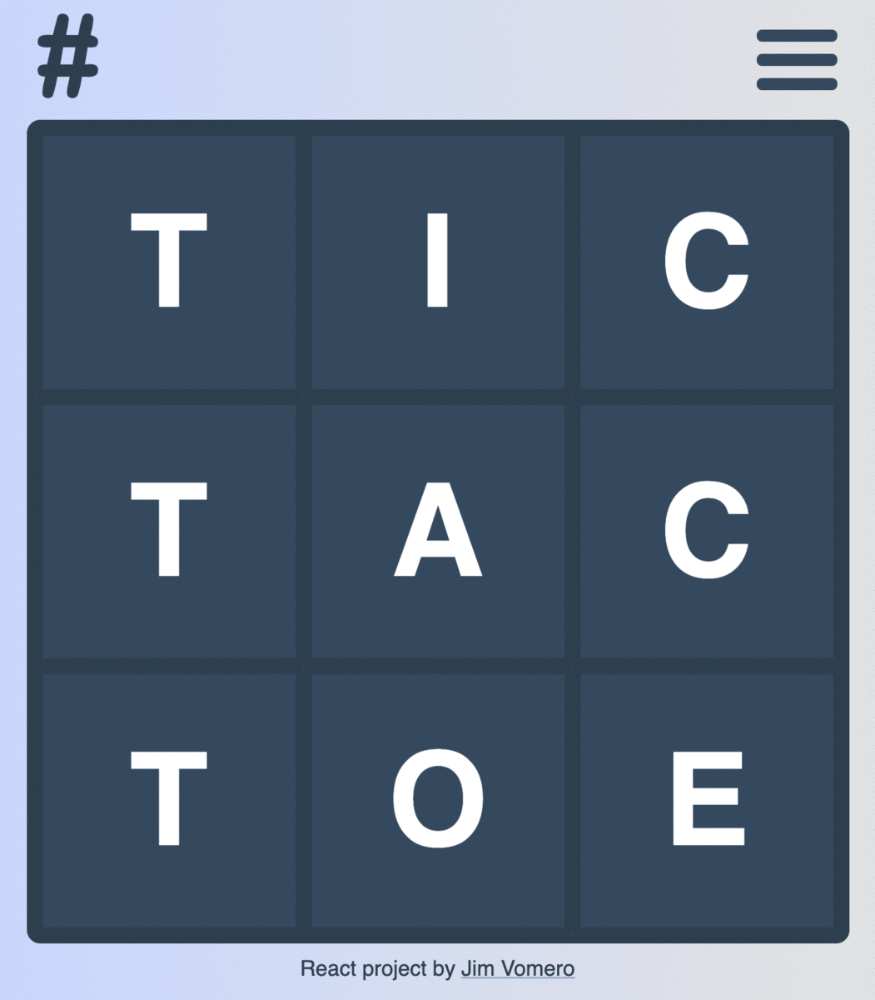

# TicTacToe JS Frameworks

This TicTacToe game is a simple sandbox project to compare ease of development, performance, and build size between multiple JS Frameworks. I want to find which framework is the easiest and most fun to work in, but also compare this against the technical bloat associated with each one. I'll publish the findings in a future blog post.

## Current Implementations

- [TicTacToe ReactJS](reactjs/README.md)
- [TicTacToe PreactJS](preactjs/README.md) | [Play](https://vomero-preact.netlify.app)

## Game Screenshots

## Possible Future Versions

I'm mostly a backend engineer and am using this project as an excuse to sharpen some of my frontend skills. I hope to create additional versions of this game in: Vanilla JS, Svelte, Vue JS, Angular JS.
